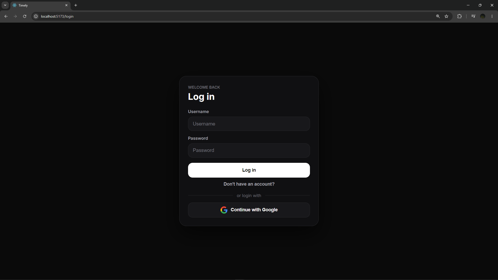
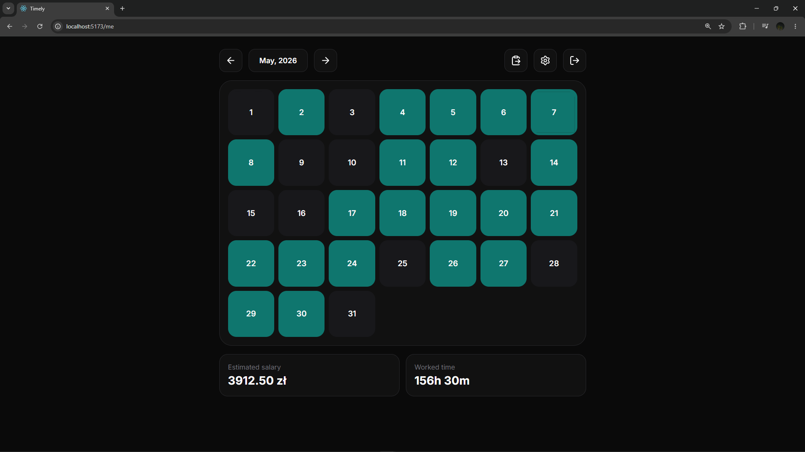
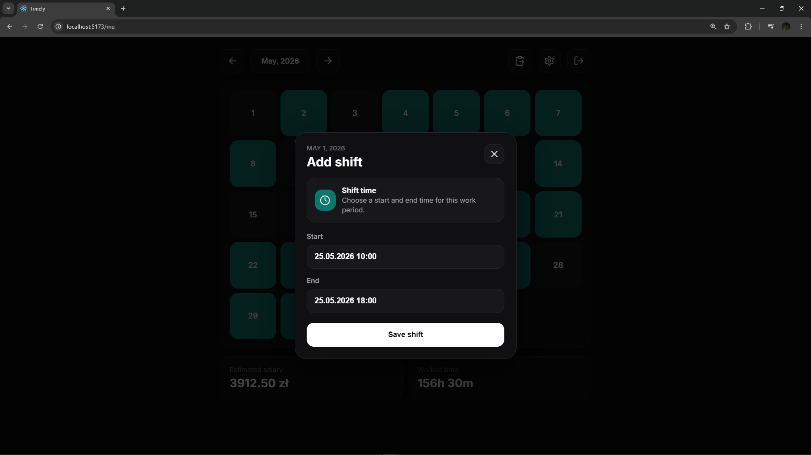
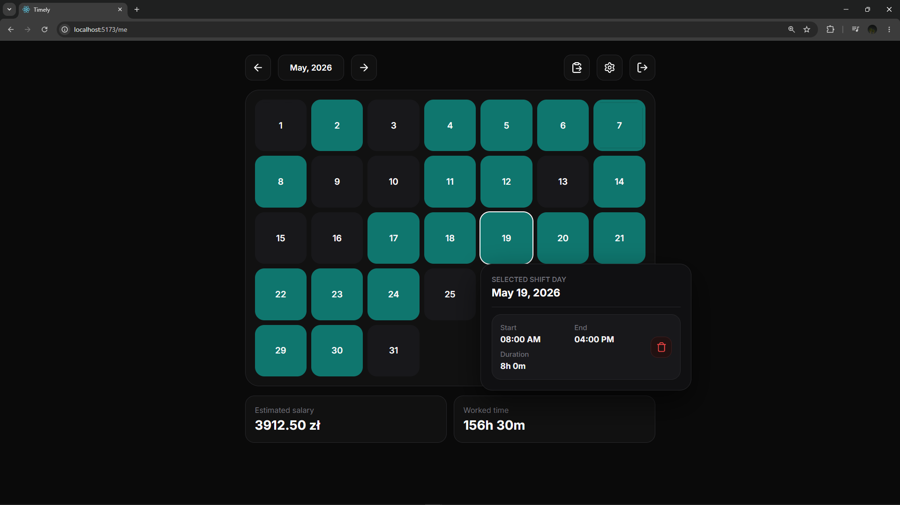
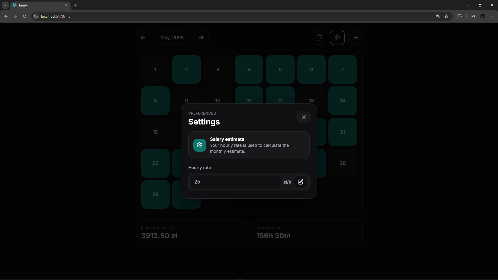

# Shift Tracker

A full-stack employee time tracking platform for logging work hours, viewing monthly summaries, and estimating salary.

## Features

- Log in with an administrator-provisioned username and password
- View shifts by month
- Add and delete shifts
- Import shifts from pasted text
- Track total worked time
- Estimate salary from hourly rate

## Screenshots

### Login

### Shifts

### Add shift

### Selected shift day

### Settings

